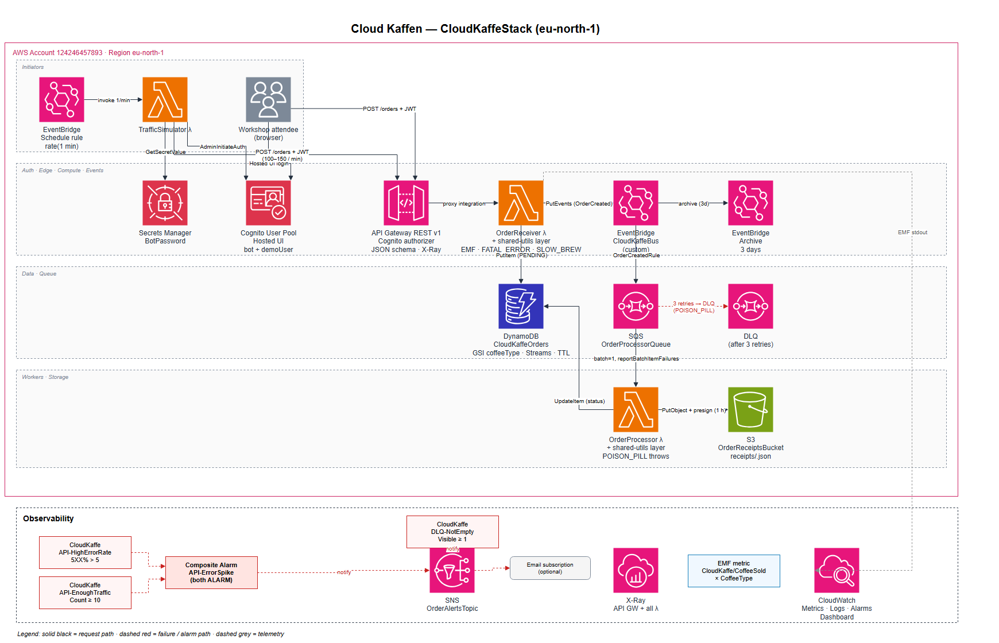

# Cloud Kaffen (velliv-cloud-coffee)

AWS CDK v2 TypeScript project for a full-day AWS masterclass workshop. Serverless order-management system with deliberately-injected chaos (traffic simulator, FATAL_ERROR, SLOW_BREW, POISON_PILL) that drives DLQs, alarms, and EMF metrics visible in CloudWatch from the moment you deploy.

See `docs/workshop-agenda.md` for the workshop agenda (Danish), `docs/infrastructure.md` for the original resource spec, and the canonical design doc in `~/.gstack/projects/rasmusd-cloud2-velliv-cloud-coffee/rasmu-main-design-20260424-100858.md`.

## Architecture



Solid black = request path · dashed red = failure / alarm path · dashed grey = telemetry.

## Prereqs

- Node 20+
- AWS CLI v2 installed
- AWS CDK CLI v2 (`npm install -g aws-cdk`)
- Admin IAM role on the target AWS account (no SCPs blocking Cognito domain creation, EventBridge archive, IAM role creation, etc.)

## Setup

```bash
git clone https://github.com/rasmusd-cloud2/velliv-cloud-coffee.git
cd velliv-cloud-coffee
npm install
```

## Configure AWS credentials (SSO, default profile)

One-time setup of the `default` profile against your SSO start URL:

```bash
aws configure sso
# SSO session name (Recommended): cloud-kaffe
# SSO start URL: https://<your-org>.awsapps.com/start
# SSO region: eu-central-1
# SSO registration scopes: sso:account:access
# (browser opens, approve)
# CLI default client Region: eu-central-1
# CLI default output format: json
# CLI profile name: default
```

On later days, just refresh the token:

```bash
aws sso login
aws sts get-caller-identity   # verify
```

Bootstrap the target account/region once (uses the default profile):

```bash
cdk bootstrap aws://<ACCOUNT>/eu-central-1
```

## Deploy

This stack is multi-tenant within a single AWS account. Every team member
deploys their **own isolated stack** by passing a `developer` namespace —
no resource-name collisions, no shared state.

### 1. Pick a developer namespace

The `developer` context value becomes a suffix on every named AWS resource
(Cognito user pool + Hosted UI domain, EventBus, SQS, alarms, dashboard, API,
EMF metric namespace, secret, layer, ...). The stack name itself becomes
`CloudKaffeStack-<developer>`.

Rules: lowercased, non-alphanumerics stripped, 2–16 chars. Use your handle
or first name — `alice`, `bob`, `rasmus`.

The CLI looks up `developer` in this order, first hit wins:

1. `-c developer=<name>` flag
2. `$DEVELOPER` env var
3. `$USER` / `$USERNAME` env var (your OS login)

So on a personal machine `cdk deploy` "just works"; on shared CI/laptops
pass `-c developer=...` explicitly.

### 2. First deploy

```bash
# Make sure SSO is fresh
aws sso login

# Deploy. Stack becomes CloudKaffeStack-alice.
cdk deploy -c developer=alice
```

Expected time: **12–15 min cold** (Cognito user pool + domain + API Gateway
stage dominate). Subsequent `cdk deploy` runs are seconds when nothing
changed.

### 3. Optional flags

All passed via `-c key=value`. Combine freely.

| Flag                  | Default       | Purpose                                                |
|-----------------------|---------------|--------------------------------------------------------|
| `developer`           | `$USER`       | Per-developer namespace (see §1)                       |
| `account`             | from CLI/SSO  | Override AWS account                                   |
| `region`              | `eu-north-1`  | Override AWS region                                    |
| `enableSimulator`     | `false`       | Turn the per-minute traffic generator ON (see below)   |
| `archiveRetentionDays`| `3`           | EventBridge archive retention                          |
| `demoPassword`        | `Kaffe123!`   | demoUser password (Module 4 Hosted UI login)           |
| `alertEmail`          | _(none)_      | Subscribe email to the SNS alerts topic                |
| `domainPrefix`        | auto         | Override Cognito Hosted UI prefix                       |

```bash
cdk deploy -c developer=alice -c enableSimulator=true -c alertEmail=you@example.com
```

### 4. Enable the traffic simulator

The EventBridge schedule that fires `TrafficSimulator` every minute is
**disabled on a fresh deploy** — the stack idles for ~$0/day until you opt in.
There are two ways to enable it:

**A. At deploy time (declarative — survives subsequent deploys as long as
the flag stays set):**

```bash
cdk deploy -c developer=alice -c enableSimulator=true
```

**B. On an already-deployed stack (imperative — fast, no CDK round-trip):**

```bash
# Turn on for a workshop session
aws events enable-rule  --region eu-central-1 \
  --name "CloudKaffeStack-alice-TrafficSimulatorSchedule"

# Turn off again
aws events disable-rule --region eu-central-1 \
  --name "CloudKaffeStack-alice-TrafficSimulatorSchedule"
```

⚠️ The next `cdk deploy` without `-c enableSimulator=true` will revert the
rule to **disabled**. During a workshop, either keep `enableSimulator=true`
in your deploy command or avoid redeploying mid-session.

### 5. List / verify your stacks

```bash
aws cloudformation list-stacks \
  --stack-status-filter CREATE_COMPLETE UPDATE_COMPLETE \
  --query "StackSummaries[?starts_with(StackName, 'CloudKaffeStack-')].StackName"
```

If the SSO token expires mid-day: `aws sso login` and rerun.

## What gets deployed

- Cognito User Pool with Hosted UI, bot user (for simulator) + demoUser (for workshop attendees)
- DynamoDB orders table (PAY_PER_REQUEST, GSI on `coffeeType`, Streams NEW_IMAGE, TTL `expiresAt`) — auto-named per developer stack
- S3 OrderReceipts bucket (block public, auto-delete on destroy)
- EventBridge `CloudKaffeBus-<dev>` + 3-day archive + OrderCreated rule
- SQS OrderProcessor queue + DLQ + depth alarm — auto-named per developer stack
- SNS `CloudKaffeOrderAlerts-<dev>` topic
- 3 Lambdas: OrderReceiver, OrderProcessor, TrafficSimulator
- API Gateway REST API v1 with Cognito authorizer + schema validator + X-Ray
- CloudWatch composite alarm (5XX rate > 5% AND request count >= 10)
- EventBridge rule scheduling TrafficSimulator every 1 minute (**disabled by default** — see Deploy §4)

## Workshop module pointers

Cross-referenced with `docs/workshop-agenda.md`.

### Module 1 — Observability

- EMF `CoffeeSold` metric by `CoffeeType` dimension: CloudWatch → Metrics → CloudKaffe namespace
- Log Insights query for errors:
  ```
  fields @timestamp, @message
  | filter @message like /ERROR/
  | sort @timestamp desc
  ```
- Composite alarm `CloudKaffe-API-ErrorSpike-<dev>`: fires when FATAL_ERROR chaos drives 5XX rate > 5% AND request count >= 10 in 1 min
- DLQ depth alarm `CloudKaffe-DLQ-NotEmpty-<dev>`: fires when POISON_PILL chaos fills DLQ

### Module 2 — Compute & API

- Lambda init vs invoke duration visible in each Lambda's log group
- API Gateway console → `CloudKaffeOrdersApi-<dev>` → Stages → `v1`

### Module 3 — IaC (CDK & CFN)

- `npx cdk synth` prints the full CloudFormation template
- `npx cdk diff` (after deploy) shows empty — idempotent
- CloudFormation console → `CloudKaffeStack-<dev>` → Events / Resources tabs

### Module 4 — Auth (Cognito)

- CDK output `HostedUiUrl` prints the full Hosted UI login URL
- Login as: `demoUser / Kaffe123!` (override via `-c demoPassword=X`)
- Copy the JWT from the redirect URL hash, paste into https://jwt.io
- Test POST /orders:
  ```bash
  # Without token - expect 401
  curl -X POST <ApiEndpoint>orders -d '{"coffeeType":"Latte","size":"Large"}'

  # With valid body + JWT - expect 200
  curl -X POST <ApiEndpoint>orders \
    -H "Authorization: Bearer <YOUR_JWT>" \
    -H "Content-Type: application/json" \
    -d '{"coffeeType":"Latte","size":"Large"}'

  # With bad schema + JWT - expect 400
  curl -X POST <ApiEndpoint>orders \
    -H "Authorization: Bearer <YOUR_JWT>" \
    -H "Content-Type: application/json" \
    -d '{"size":"Large"}'
  ```

### Module 5 — Data & Events

- DynamoDB console → look for the OrdersTable owned by `CloudKaffeStack-<dev>` → Items. Demo Query (cheap) vs Scan (expensive).
- SQS console → OrderProcessor queue owned by `CloudKaffeStack-<dev>` → Visibility Timeout, DLQ redrive
- EventBridge console → Buses → `CloudKaffeBus-<dev>` → Rules → `OrderCreatedToProcessor-<dev>`
- Event Archive → `CloudKaffeArchive-<dev>` → Replay. Receipt keys are **deterministic** (`receipts/${orderId}.json`) so replay reprocesses in place — no duplicate files.
- OrderProcessor logs show `presignedUrl` per order — click the URL in CloudWatch Logs to open the receipt JSON in the browser (valid 1 hour).

## Destroy

```bash
cdk destroy -c developer=alice
```

Expected 5–8 min. Archive deletion is the slow step. Cleaner than before thanks to:
- 3-day archive retention (shorter than demo default of 30 days)
- Explicit log groups with `RemovalPolicy.DESTROY`
- S3 bucket `autoDeleteObjects: true`
- Cognito user pool + cascade-deleted bot/demo users via L1 `CfnUserPoolUser`

Verify zero orphans (substitute your developer namespace):

```bash
DEV=alice
aws logs describe-log-groups --log-group-name-prefix "/aws/lambda/CloudKaffeStack-$DEV"
aws s3 ls | grep -i kaffe
aws cloudwatch describe-alarms --alarm-name-prefix "CloudKaffe" | grep -i "$DEV"
aws events describe-archive --archive-name "CloudKaffeArchive-$DEV"
aws cognito-idp list-user-pools --max-results 20 | grep -i "kaffe.*$DEV"
```

## Cost warning

The traffic simulator is **disabled by default** (see Deploy §4) so an idle
stack costs ≈$0/day. Once you turn it on (`enableSimulator=true` or
`aws events enable-rule`), it fires every minute until disabled or destroyed.

Rough napkin math while the simulator is **enabled** (1 attendee, 1 day):
- API Gateway: ~100 req/min × 60 × 8 hrs = ~48k req → ~$0.17
- DynamoDB PAY_PER_REQUEST: ~34k writes → ~$0.04
- CloudWatch Logs: ~100 MB → ~$0.05
- EventBridge archive storage (3 days): negligible
- **Total: <$1/day**

Habit at end of session: either disable the rule
(`aws events disable-rule ...`) or `cdk destroy`. Forgetting both = a few
dollars overnight, more if left for days.

## Next steps / out of scope

These are flagged in the design doc. Not shipped here, good candidates for follow-up:

- CI/CD (GitHub Actions: `cdk synth` on PR, `cdk deploy` on main)
- `cdk-nag` stack aspect (10 lines, catches ~40 security best-practice violations)
- Unit + snapshot tests via `aws-cdk-lib/assertions`
- Multi-stack split (auth/data/compute/sim)
- DDB Streams → Pipes outbox pattern (fixes split-brain write path between DDB and EventBridge)

## Known gaps (workshop context)

- **Split-brain write path:** OrderReceiver writes DDB then publishes EventBridge. If the PutEvents fails, order is stored but never processed. Known; not fixed in this scaffold. Production fix = DDB Streams → Pipes (see next steps above).
- **DDB Streams, TTL, OAuth scope** are spec'd but not wired to a consumer. Instructor discretion on whether to showcase during Module 5 or leave as "these are here when you need them."

## Demo notes

### Authenticating as `demoUser` and getting a token

Two ways to obtain a JWT for `POST /orders`.

#### 1. Hosted UI (browser, implicit grant) — what the workshop uses

After deploy, the `HostedUiUrl` stack output (`cloud-kaffe-stack.ts:87`) gives you a URL like:

```
https://cloud-kaffe-<account>-<developer>.auth.eu-north-1.amazoncognito.com/login?client_id=<CLIENT_ID>&response_type=token&redirect_uri=https://example.com
```

Steps:

1. Open URL in browser.
2. Sign in: `demoUser` / `Kaffe123!` (or whatever `demoPassword` you deployed with).
3. Cognito redirects to `https://example.com#id_token=<JWT>&access_token=...&expires_in=3600&token_type=Bearer`.
4. Copy `id_token` from the URL fragment.
5. Use it:

```bash
curl -X POST https://<api-id>.execute-api.eu-north-1.amazonaws.com/prod/orders \
  -H "Authorization: Bearer <id_token>" \
  -H "Content-Type: application/json" \
  -d '{"item":"latte"}'
```

Token valid 1h. The `example.com` page won't load — that's expected; the token is in the URL bar, that's the point.

#### 2. CLI via AWS SDK (`AdminInitiateAuth`)

The App Client has the `adminUserPassword` flow enabled (`auth.ts:92`), same as the bot uses. Needs AWS credentials with `cognito-idp:AdminInitiateAuth` on the pool.

```bash
USER_POOL_ID=$(aws cognito-idp list-user-pools --max-results 50 \
  --query "UserPools[?Name=='CloudKaffeUsers-<developer>'].Id" --output text)

CLIENT_ID=$(aws cognito-idp list-user-pool-clients --user-pool-id "$USER_POOL_ID" \
  --query "UserPoolClients[0].ClientId" --output text)

aws cognito-idp admin-initiate-auth \
  --user-pool-id "$USER_POOL_ID" \
  --client-id "$CLIENT_ID" \
  --auth-flow ADMIN_USER_PASSWORD_AUTH \
  --auth-parameters USERNAME=demoUser,PASSWORD=Kaffe123! \
  --query 'AuthenticationResult.IdToken' --output text
```

Pipe to `TOKEN=$(...)` then `curl -H "Authorization: Bearer $TOKEN" ...`.

#### Which token?

API Gateway's `CognitoUserPoolsAuthorizer` accepts either `IdToken` or `AccessToken`. `IdToken` is simplest — no scope check on the method (`api-and-compute.ts:239` uses plain `COGNITO`, no `authorizationScopes`), so the `orders/write` scope isn't required.
